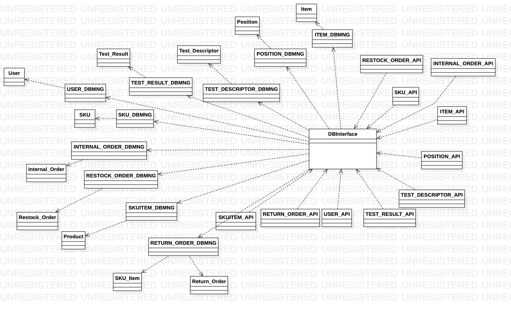

# Integration and API Test Report

Date: 16/06/2022

Version: 1.2 

| Version number | Change                       |
|----------------|------------------------------|
| 1.1            | Add all the contents         |
| 1.2            | Modification according to change1 |

# Contents

- [Dependency graph](#dependency graph)

- [Integration approach](#integration)

- [Tests](#tests)

- [Scenarios](#scenarios)

- [Coverage of scenarios and FR](#scenario-coverage)
- [Coverage of non-functional requirements](#nfr-coverage)

# Dependency graph 

     
# Integration approach
We adopted the bottom up approach.

## Step 1 classes:
`INTERNAL_ORDER_DBMNG, ITEM_DBMNG, POSITION_DBMNG, RESTOCK_ORDER_DBMNG, RETURN_ORDER_DBMNG, SKU_DBMNG, SKUITEM_DBMNG,  TEST_DESCRIPTOR_DBMNG, TEST_RESULT_DBMNG, USER_DBMNG`

These classes for accessing to the database were tested during the JunitTest.

## Step 2 classes:
`DBInterface, SKU_DBMNG, POSITION_DBMNG, RESTOCK_ORDER_DBMNG`

For this step, we have integrated the middleware with some dao classes

## Step 3 classes:
`INTERNAL_ORDER_API, ITEM_API, POSITION_API, RESTOCK_ORDER_API, RETURN_ORDER_API, SKU_API, SKUITEM_API,  TEST_DESCRIPTOR_API, TEST_RESULT_API, USER_API, DBInterface, modules/db`

#  Integration Tests

## Step 1
| Classes  | mock up used |Jest test cases |
|--|--|--|
|INTERNAL_ORDER_DBMNG||code/server/unit_test/internalorderdbmng.test.js|
|ITEM_DBMNG||code/server/unit_test/itemdbmng.test.js|
|POSITION_DBMNG||code/server/unit_test/positiondbmng.test.js|
|RESTOCK_ORDER_DBMNG||code/server/unit_test/restockorderdbmng.test.js|
|RETURN_ORDER_DBMNG||code/server/unit_test/returnorderdbmng.test.js|
|SKU_DBMNG||code/server/unit_test/skudbmng.test.js|
|SKUITEM_DBMNG||code/server/unit_test/skuitemdbmng.test.js|
|TEST_DESCRIPTOR_DBMNG||code/server/unit_test/testdescdbmng.test.js|
|TEST_RESULT_DBMNG||code/server/unit_test/testresdbmng.test.js|
|USER_DBMNG||code/server/unit_test/userdbmng.test.js|

## Step 2
| Classes  | mock up used |Jest test cases |
|--|--|--|
|DBInterface + SKU_DBMNG + POSITION_DBMNG| |db_interface_integratedDB.test|
|DBInterface + SKU_DBMNG + RESTOCK_ORDER_DBMNG| |db_interface_integratedDB.test|
|DBInterface|skudb_mock|dbinterface_mockdb.test|
||testdescriptordb_mock|dbinterface_mockdb.test|

## Step 3 
| Classes  | mock up used |Jest test cases |
|--|--|--|
|INTERNAL_ORDER_API||code/server/test/internalOrderApiTest.js|
|ITEM_API||code/server/test/itemApiTest.js|
|POSITION_API||code/server/test/SkuAndPosApiTest.js|
|RESTOCK_ORDER_API||code/server/test/restockAndReturnApiTest.js|
|RETURN_ORDER_API||code/server/test/restockAndReturnApiTest.js|
|SKU_API||code/server/test/SkuAndPosApiTest.js|
|SKUITEM_API||code/server/test/skuItemApiTest.js|
|TEST_DESCRIPTOR_API||code/server/test/tDtRApiTest.js.js|
|TEST_RESULT_API||code/server/test/tDtRApiTest.js.js|
|USER_API||code/server/test/userApiTest.js|

# Coverage of Scenarios and FR

| Scenario ID | Functional Requirements covered | Mocha  Test(s) | 
| ----------- | ------------------------------- | ----------- | 
| 1.1         | FR2.1                           | code/server/test/SkuAndPosApiTest.js|             
| 1.2         | FR3.1.1                         | code/server/test/SkuAndPosApiTest.js|             
| 1.3         | FR2.1                           | code/server/test/SkuAndPosApiTest.js            |             
| 2.1         | FR3.1.1                         | code/server/test/SkuAndPosApiTest.js            |             
| 2.2         | FR3.1.4                                |   code/server/test/SkuAndPosApiTest.js          |             
| 2.3-...-2.5         | FR3.1.1-FR3.1.2-FR3.1.4                                |    code/server/test/SkuAndPosApiTest.js   |           
| 3.2         | FR5.6                        | code/server/test/restockAndReturnApiTest.js|     
| 4.1         | FR1.1                          | code/server/test/userApiTest.js|             
| 4.2         | FR1.5                       | code/server/test/userApiTest.js|    
| 4.3         | FR1.2                       | code/server/test/userApiTest.js|  
| 5.1         | FR5.8                       | code/server/test/restockAndReturnApiTest.js|
| 5.1.1         | FR5.8                       | code/server/test/restockAndReturnApiTest.js|
| 5.2.1         | FR5.8.2                      | code/server/test/restockAndReturnApiTest.js|
|||code/server/test/tDtRApiTest.js.js|
|||code/server/unit_test/skuitemdbmng.test.js|
| 5.2.2         | FR5.8.2                      | code/server/test/restockAndReturnApiTest.js|
|||code/server/test/tDtRApiTest.js.js|
|||code/server/unit_test/skuitemdbmng.test.js|
| 5.2.3         | FR5.8.2                      | code/server/test/restockAndReturnApiTest.js|
|||code/server/test/tDtRApiTest.js.js|
|||code/server/unit_test/skuitemdbmng.test.js|
| 5.3.1         | FR5.8.3                      | code/server/test/restockAndReturnApiTest.js|
|||code/server/test/tDtRApiTest.js.js|
|||code/server/unit_test/skuitemdbmng.test.js|
| 5.3.2         | FR5.8.3                      | code/server/test/restockAndReturnApiTest.js|
|||code/server/test/tDtRApiTest.js.js|
|||code/server/unit_test/skuitemdbmng.test.js|
| 5.3.3         | FR5.8.3                      | code/server/test/restockAndReturnApiTest.js|
|||code/server/test/tDtRApiTest.js.js|
|||code/server/unit_test/skuitemdbmng.test.js|
| 6.1         | FR6.1-FR6.2                      | code/server/test/restockAndReturnApiTest.js|
|||code/server/unit_test/skuitemdbmng.test.js|
| 6.2         | FR6.1-FR6.2                        | code/server/test/restockAndReturnApiTest.js|
|||code/server/unit_test/skuitemdbmng.test.js|
| 9.1         | FR6.6                      | code/server/test/internalOrderApiTest.js|
|||code/server/test/SkuAndPosApiTest.js|
| 9.2         | FR6.6                      | code/server/test/internalOrderApiTest.js|
|||code/server/test/SkuAndPosApiTest.js|
| 9.3         | FR6.6                      | code/server/test/internalOrderApiTest.js|
|||code/server/test/SkuAndPosApiTest.js|
| 10.1         | FR6.6-FR.6.7                      | code/server/test/internalOrderApiTest.js|
|||code/server/test/SkuAndPosApiTest.js|
| 11.1         | FR7                  | code/server/test/itemApiTest.js|
| 12.1         | FR3.2.1                |code/server/test/tDtRApiTest.js   code/server/test/SkuAndPosApiTest.js |
| 12.2         | FR3.2.2                | code/server/test/tDtRApiTest.js   code/server/test/SkuAndPosApiTest.js|
| 12.3         | FR3.2.3                | code/server/test/tDtRApiTest.js |

# Coverage of Non Functional Requirements

### 

| Non Functional Requirement | Test name |
| -------------------------- | --------- |
|                NFR4            |    code/server/test/SkuAndPosApiTest.js        |
|                NFR7            |    code/server/test/SkuAndPosApiTest.js        |
|                NFR8            |    code/server/test/SkuAndPosApiTest.js        |
|                NFR9            |    code/server/test/restockAndReturnApiTest.js     |

