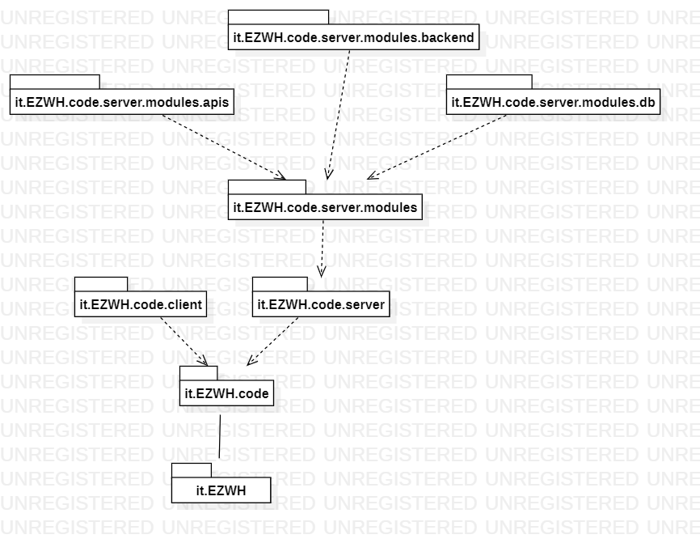
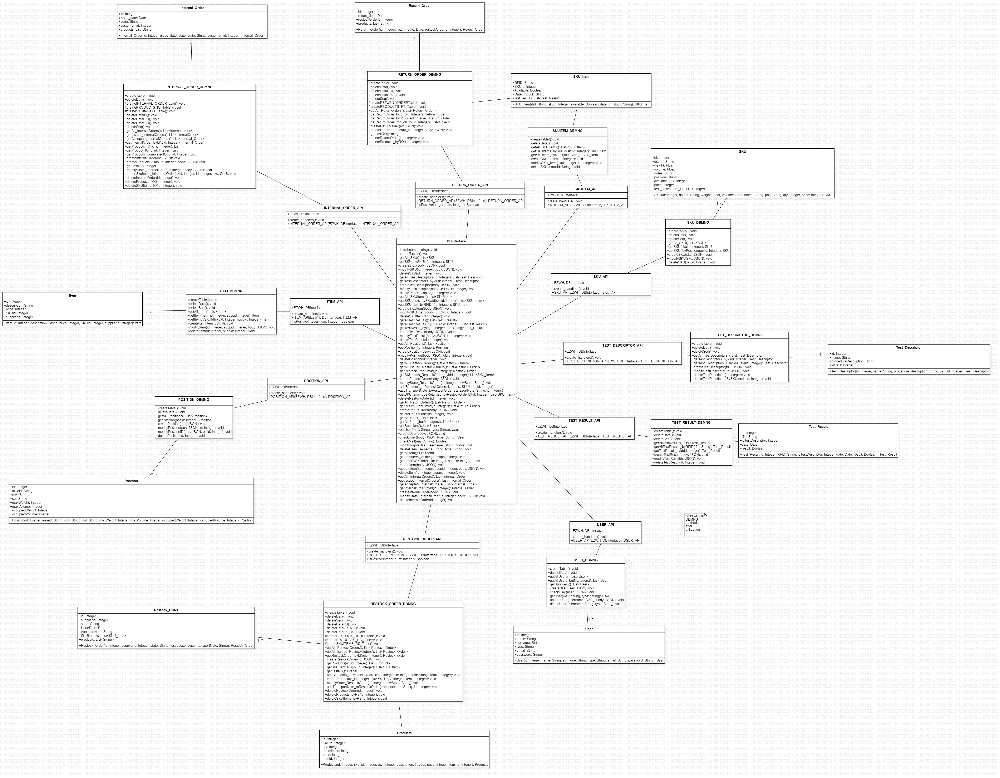
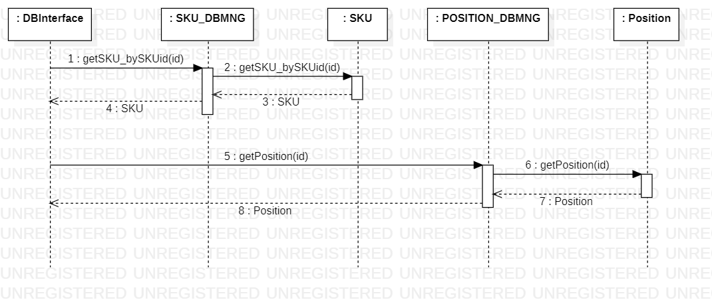
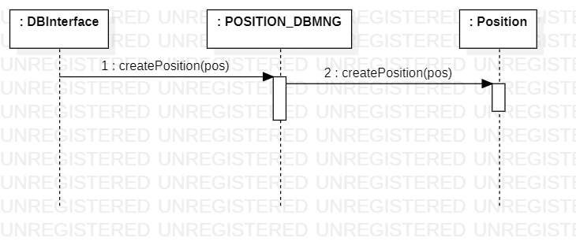
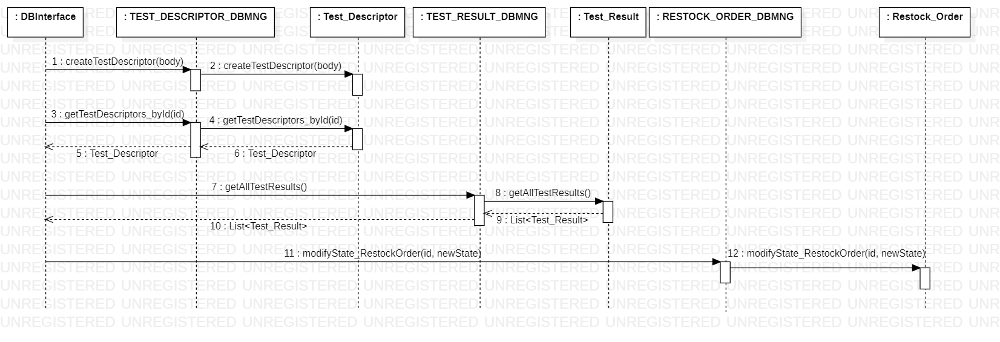
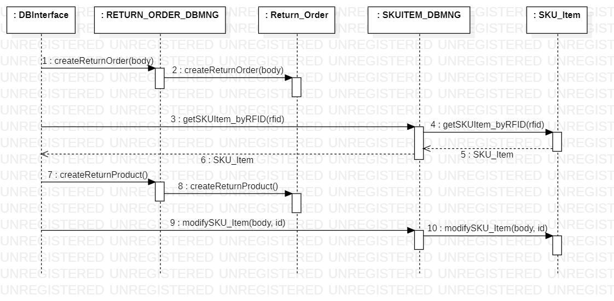
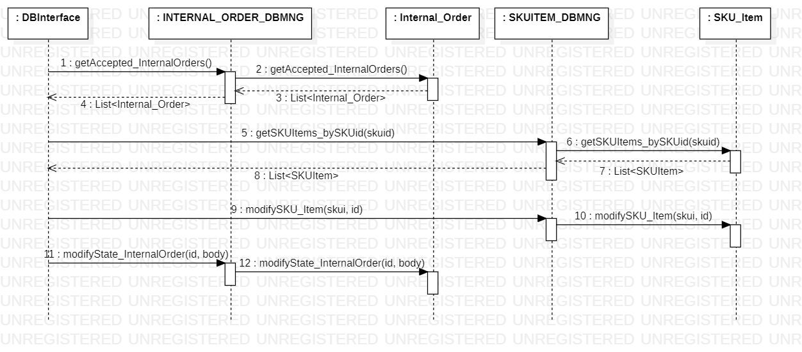

# Design Document 

Authors: 
- FRANCESCO PIO BARLETTA 			s296114@studenti.polito.it 
- SALVATORE ADALBERTO ESPOSITO   	s304800@studenti.polito.it
- NEGIN GHODS				        s301316@studenti.polito.it 
- EGE UNLUSOY 				        s305007@studenti.polito.it 

Date: 20/06/2022

Version: 1.3

| Version number | Change                       |
|----------------|------------------------------|
| 1.0            | Add all the contents         |
| 1.1            | Modification of the diagrams |
| 1.2            | Modification of low level design   Modification of Sequence Diagram 2-1 and 3-1 |
| 1.3            | Removed Sequence Diagram 3-1   Change in Traceability Matrix   Change in Low Level Diagram|
# Contents

- [High level design](#package-diagram)
- [Low level design](#class-diagram)
- [Verification traceability matrix](#verification-traceability-matrix)
- [Verification sequence diagrams](#verification-sequence-diagrams)

# Instructions

The design must satisfy the Official Requirements document, notably functional and non functional requirements, and be consistent with the APIs

# High level design 

EZwh is a layered application, it is composed of the following packets: 

- code
- client
- server
- modules
- apis
- db
- backend 

We use as an architectural pattern:

- Layered 3-tier

# Low level design

# Verification traceability matrix

|     | DBInterface | SKU | SKU_DBMNG | SKU_Item | SKUITEM_DBMNG | Position | POSITION_DBMNG | Test_Descriptor | TEST_DESCRIPTOR_DBMNG | Test_Result | TEST_RESULT_DBMNG | User | USER_DBMNG | Restock_Order | RESTOCK_ORDER_DBMNG | Products | Return_Order | RETURN_ORDER_DBMNG | Internal_Order | INTERNAL_ORDER_DBMNG | Item | ITEM_DBMNG |
|-----|-------------|-----|-----------|----------|---------------|----------|----------------|-----------------|-----------------------|-------------|-------------------|------|------------|---------------|---------------------|----------|--------------|--------------------|----------------|----------------------|------|------------|
| FR1 | x           |     |           |          |               |          |                |                 |                       |             |                   | x    | x          |               |                     |          |              |                    |                |                      |      |            |
| FR2 | x           | x   | x         |          |               |          |                |                 |                       |             |                   |      |            |               |                     |          |              |                    |                |                      |      |            |
| FR3 | x           | x   | x         |          |               | x        | x              | x               | x                     |             |                   |      |            |               |                     |          |              |                    |                |                      |      |            |
| FR4 | x           |     |           |          |               |          |                |                 |                       |             |                   | x    | x          |               |                     |          |              |                    |                |                      |      |            |
| FR5 | x           |     |           | x        | x             |          |                |                 |                       | x           | x                 |      |            | x             | x                   | x        | x            | x                  |                |                      |      |            |
| FR6 | x           |     |           |    x     |        x      |          |                |                 |                       |             |                   |      |            |               |                     |          |              |                    | x              | x                    |      |            |
| FR7 | x           |     |           |          |               |          |                |                 |                       |             |                   |      |            |               |                     |          |              |                    |                |                      | x    | x          |

# Verification sequence diagrams 

## Sequence Diagram Scenario 1-2 - Modify SKU Position

## Sequence Diagram 2-1 - Create Position

## Sequence Diagram 5-2-3 - Record negative and positive test results of all SKU items of a RestockOrder

## Sequence Diagram 6-1 - Return order of SKU items that failed quality test

## Sequence Diagram 10-1 - Internal Order IO Completed

