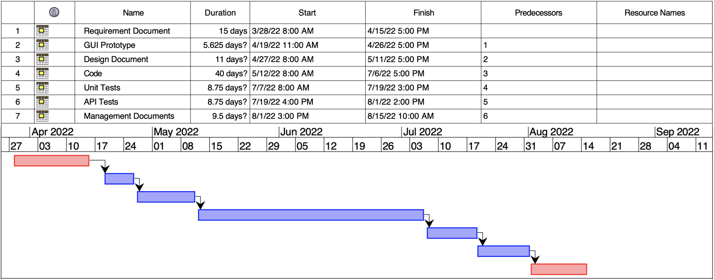

# Project Estimation  
Date: 10 April 2022

Version: 1.1

# Estimation approach
Consider the EZWH  project as described in YOUR requirement document, assume that you are going to develop the project INDEPENDENT of the deadlines of the course
# Estimate by size
### 
|             | Estimate                        |             
| ----------- | ------------------------------- |  
| NC =  Estimated number of classes to be developed   |  20   |             
|  A = Estimated average size per class, in LOC       |  40   | 
| S = Estimated size of project, in LOC (= NC * A) | 40*20 = 8000 |   
| E = Estimated effort, in person hours (here use productivity 10 LOC per person hour)  |        8000/10 = 800 person hours      |   
| C = Estimated cost, in euro (here use 1 person hour cost = 30 euro) | 800*30 = 24000 euros | 
| Estimated calendar time, in calendar weeks (Assume team of 4 people, 8 hours per day, 5 days per week ) |       7 weeks         |               

- 800/4 = 200 hour - 40 hours per week - 200/40 = 50 hours per week - 50/7 = 7 weeks 

# Estimate by product decomposition
### 
|         component name    | Estimated effort (person hours)   |             
| ----------- | ------------------------------- | 
|requirement document    | 130ph |
| GUI prototype | 45ph |
|design document | 88ph |
|code |  320ph  |
| unit tests |  70ph   |
| api tests  |    70ph     |
| management documents  |    76ph   |

# Estimate by activity decomposition
### 
|         Activity name    | Estimated effort (person hours)   |             
| ----------- | ------------------------------- | 
|requirement document    | 130ph |
| GUI prototype | 45ph |
|design document | 88ph |
|code |  320ph  |
| unit tests |  70ph   |
| api tests  |    70ph     |
| management documents  |    76ph   |
###

# Summary

|             | Estimated effort                        |   Estimated duration |          
| ----------- | ------------------------------- | ---------------|
| estimate by size | 800 | 200 |
| estimate by product decomposition | 800 | 200 |
| estimate by activity decomposition |800| 200|

