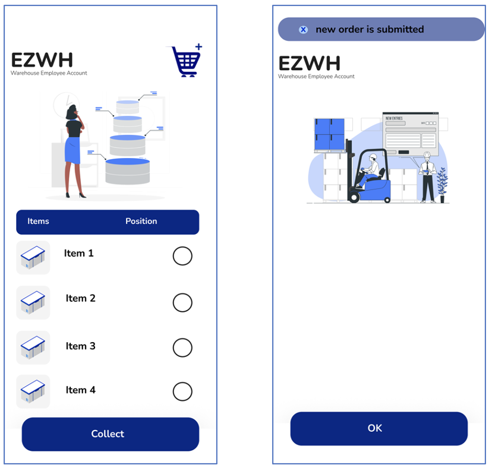
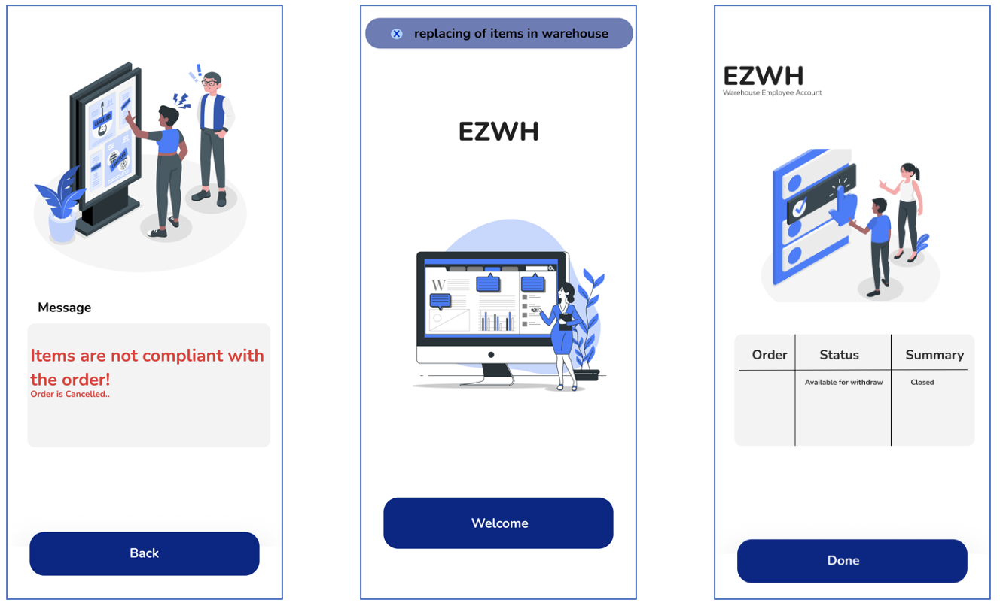

# Graphical User Interface Prototype  

Authors: Negin Ghods 

Date: 10 April 2022

Version: 1.1

### Use case 1, UC1 - Manage Login 

### Use case 2, UC2 - Quality Check

### Use case 3, UC3 - Track Item

### Use case 4, UC4 - Issue Order

### Use case 5, UC5 - Issue an internal order

### Use case 6, UC6 - Manage an internal order

### Use case 7, UC7 - Collect order

### Use case 8, UC8 - Manage items

### Use case 10, UC10 - Check in short supply items

### Use case 11, UC11 - List all items

