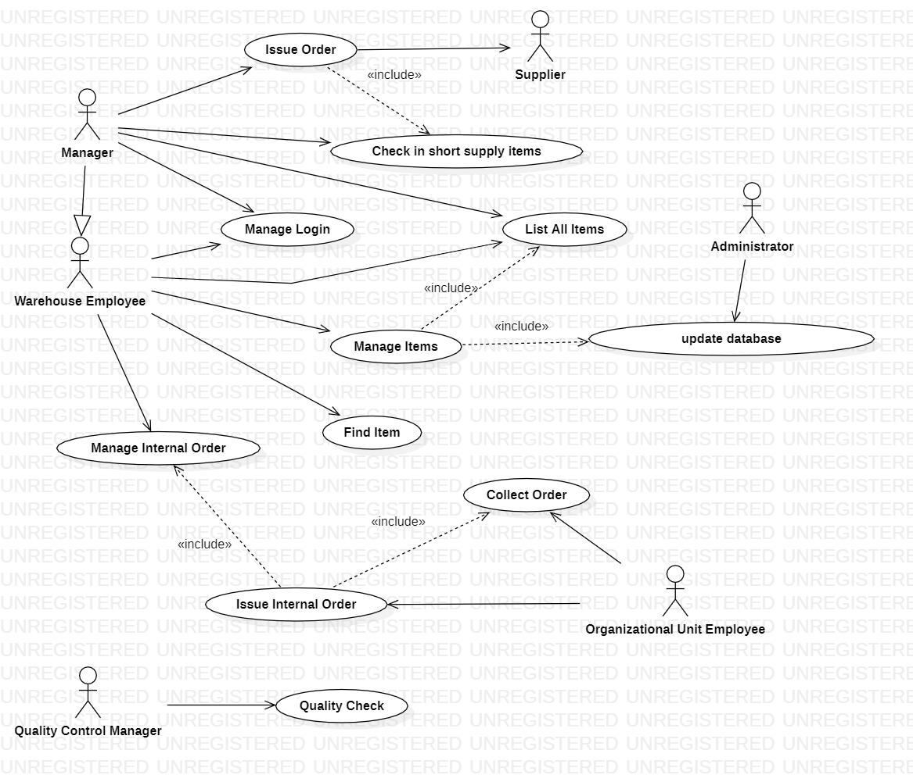

 #Requirements Document 

Date: 09 April 2022

Version: 1.2

 
| Version number | Change |
| ----------------- |:-----------|
| 1.0 | Add all the contents |
| 1.1 | Change in UML Cases  |
| 1.2 | Change in Glossary   |

# Contents

- [Informal description](#informal-description)
- [Stakeholders](#stakeholders)
- [Context Diagram and interfaces](#context-diagram-and-interfaces)
	+ [Context Diagram](#context-diagram)
	+ [Interfaces](#interfaces) 
	
- [Stories and personas](#stories-and-personas)
- [Functional and non functional requirements](#functional-and-non-functional-requirements)
	+ [Functional Requirements](#functional-requirements)
	+ [Non functional requirements](#non-functional-requirements)
- [Use case diagram and use cases](#use-case-diagram-and-use-cases)
	+ [Use case diagram](#use-case-diagram)
	+ [Use cases](#use-cases)
    	+ [Relevant scenarios](#relevant-scenarios)
- [Glossary](#glossary)
- [System design](#system-design)
- [Deployment diagram](#deployment-diagram)

# Informal description
Medium companies and retailers need a simple application to manage the relationship with suppliers and the inventory of physical items stocked in a physical warehouse. 
The warehouse is supervised by a manager, who supervises the availability of items. When a certain item is in short supply, the manager issues an order to a supplier. In general the same item can be purchased by many suppliers. The warehouse keeps a list of possible suppliers per item. 

After some time the items ordered to a supplier are received. The items must be quality checked and stored in specific positions in the warehouse. The quality check is performed by specific roles (quality office), who apply specific tests for item (different items are tested differently). Possibly the tests are not made at all, or made randomly on some of the items received. If an item does not pass a quality test it may be rejected and sent back to the supplier. 

Storage of items in the warehouse must take into account the availability of physical space in the warehouse. Further the position of items must be traced to guide later recollection of them.

The warehouse is part of a company. Other organizational units (OU) of the company may ask for items in the warehouse. This is implemented via internal orders, received by the warehouse. Upon reception of an internal order the warehouse must collect the requested item(s), prepare them and deliver them to a pick up area. When the item is collected by the other OU the internal order is completed. 

EZWH (EaSy WareHouse) is a software application to support the management of a warehouse.

# Stakeholders

| Stakeholder name  | Description | 
| ----------------- |:-----------:|
| Warehouse Employee | manages internal orders from OU |
| Manager | supervises the availability of items and issues new orders |
| Suppliers | supply goods and products |
| Quality office | performs checks on items |
| Administrator | manages application performance |
| Start up investor | provide financial backing for startup |
| Competitor | produces software for managing a Warehouse |
| Developer | develops the application |
| Organizational Units Employee | produces software for managing a Warehouse |

# Context Diagram and interfaces

## Context Diagram

## Interfaces

| Actor | Logical Interface | Physical Interface  |
| ------------- |:-------------:| -----:|
| Manager | Web GUI | Smartphone screen |
| Warehouse Employee | Web GUI | Smartphone screen |
| Supplier | e-Mail, Phone Call/SMS | Smartphone screen |
| Administrator | Web GUI | Smartphone screen |
| Quality control manager |  Web GUI | Smartphone screen |
| OU Employee |  Web GUI | Smartphone screen |
| Developer |  Web GUI, Command Line interface | Smartphone screen |

# Stories and personas
The following personas and stories are meant to cover different profiles of the User actor:

- **Frank** is 35, he is the Manager of the company that uses EZWH. Frank has more than 15 years of experience in this sector. Previously, Frank founded and sold his own company and has been on the founding team of multiple venture-backed companies.

- **Chiara** is 30, she works for a supplier of EZWH. She works with many warehouses so her main interests are having an easy way to retrieve orders from different companies for different products and locating the items as close to the warehouse location as possible.

- **Marco** is 26, he is an employee who works in the warehouse of a company. He needs the software to show him the position of items so that he can get them easily.

- **Antonio** is a 30 years old busy person who works as an administrator of EZWH. He monitors performance and maintains systems according to requirements. He really needs to work in a quiet place without distractions and likes to be the best in his job and duties.

# Functional and non functional requirements

## Functional Requirements

| ID        | Description  |
| ------------- |:-------------:| 
| FR1 | Issue Orders |
| FR1.1 | Check availability of an item|
| FR1.2 | Check for free space availability|
| FR1.3 | Choose among suppliers|
| FR1.4 | Select quantity|
| FR1.5 | Show list of orders to suppliers |
| FR2 | Perform a quality check|
| FR2.1 | Select the item to be checked|
| FR2.2 |Check the list of specific tests for the item|
| FR2.3 | Mark passed tests |
| FR2.4 | If test fails return item to supplier |
| FR3 | Manage item |
| FR3.1 | Add item |
| FR3.2 | Delete item |
| FR3.3 | Search item |
| FR3.4 | Specify suppliers |
| FR3.5 | Set position in the warehouse |
| FR3.6 | Specify available quantity |
| FR4 | Manage internal orders |
| FR4.1 | Get position of ordered items |
| FR4.2 | Show list of internal orders |
| FR4.3 | Change order status |
| FR5 | Differentiate between different roles login |

## Non Functional Requirements

| ID        | Type (efficiency, reliability, ..)           | Description  | Refers to |
| ------------- |:-------------:| :-----:| -----:|
|  NFR1     | Performance  | All functions should be done in <0.5sec | All FR |
|  NFR2     | Usability | Application should be used without specific training | All FR |
|  NFR3     | Consistency | Keep the database up-to-date with  respect to availability of items | FR1, FR3, FR4 |
| NFR4 | Portability | Application should be accessed by all the browsers (Mozilla Firefox, Chrome, Safari…), operating systems (MacOS, Linux, Windows) | All FR| 
| NFR5 | Security | Roles should not overlap | FR5 | 
| NFR6 | Reliability | In case of failure, there is the need of a database’s backup | All FR| 

# Use case diagram and use cases

## Use case diagram

### Use case 1, UC1 - Manage Login 
| Actors Involved        | Warehouse employee, Manager  |
| ------------- |:-------------:| 
|  Precondition     | Account U exist |
|  Post condition     | Account U successfully authenticated with his rights to the platform |
|  Nominal Scenario     | Account U logins on the platform with his rights |
|  Variants     |  Warehouse Employee logins, Manager logins, OU Logins |
|  Exceptions     | Wrong Password, Forgotten Password |

---

---

| Scenario 1.1 | Warehouse employee |
| ------------- |:-------------:| 
|  Precondition     | Account U exist |
|  Post condition     | Account U successfully authenticated with his rights to the platform |
| Step#        | Description  |
|  1     | Account U is a Warehouse Employee |  
|  2     | Account U logins with his credentials |
|  3     | Account U authenticated and authorized as ‘Warehouse employee’ user |

| Scenario 1.2 | OU |
| ------------- |:-------------:| 
|  Precondition     | Account U exist |
|  Post condition     | Account U successfully authenticated with his rights to the platform |
| Step#        | Description  |
|  1     | Account U is a OU |  
|  2     | Account U logins with his credentials |
|  3     | Account U authenticated and authorized as ‘OU’ user |

| Scenario 1.3 | Manager |
| ------------- |:-------------:| 
|  Precondition     | Account U exist |
|  Post condition     | Account U successfully authenticated with his rights to the platform |
| Step#        | Description  |
|  1     | Account U is a Manager |  
|  2     | Account U logins with his credentials |
|  3     | Account U authenticated and authorized as 'Manager' user |

| Scenario 1.4 | Wrong Password |
| ------------- |:-------------:| 
|  Precondition     | Account U exist |
|  Post condition     | Account U is not authenticated |
| Step#        | Description  |
|  1     | Account U logins with his credentials |  
|  2     | Application does not recognize password - ‘wrong password’ |

---
---
---

### Use case 2, UC2 - Quality Check
| Actors Involved        |  Quality control manager |
| ------------- |:-------------:| 
|  Precondition     | Selected item is present in the database |
|  Post condition     | Quality check over |
|  Nominal Scenario     | Quality office gets the item, applies specific tests for that item and marks it |
|  Variants     |  |
|  Exceptions     | Item does not pass the quality check and  sent back to the supplier |

---
---

| Scenario 2.1 | Test Passed |
| ------------- |:-------------:| 
|  Precondition     | Selected item is received from the supplier |
|  Post condition     | Selected item is stored in the warehouse |
| Step#        | Description  |
|  1     | Quality office gets the item |  
| 2 | Position is shown |
| 3 | Item is collected |
| 4 | Quality office applies specific tests for the item |
| 5 | Item passes the test |
| 6 | Item is put in his previous place in warehouse |

| Scenario 2.2 | Test Failed |
| ------------- |:-------------:| 
|  Precondition     | Selected item is received from the supplier |
|  Post condition     | Selected item is sent back to the supplier |
| Step#        | Description  |
|  1     | Quality office gets the item |  
|  2     | Quality office applies specific tests for the item |
| 3 | Item does not pass the test |
| 4 | Item is sent back to the supplier |

---
---
---

### Use case 3, UC3 - Track Item
| Actors Involved        | Warehouse Employee |
| ------------- |:-------------:| 
|  Precondition     | Selected item is in the warehouse |
|  Post condition     | Position of the item is known |
|  Nominal Scenario     | User gets the position of the selected item |
|  Variants     |  |
|  Exceptions     | Unable to get the position |

---
---

| Scenario 3.1 | Successful Tracking |
| ------------- |:-------------:| 
|  Precondition     | Selected item is in the warehouse |
|  Post condition     | Position of the item is known |
| Step#        | Description  |
|  1     | Employee queries an item ID |  
|  2     | Position of the item is retrieved from the database |
| 3 | User gets the position of the selected item |

---
---
---
### Use case 4, UC4 - Issue Order
| Actors Involved        | Manager, Supplier |
| ------------- |:-------------:| 
|  Precondition     | Item is in short supply |
|  Post condition     | Order is issued to the supplier |
|  Nominal Scenario     | Issue order to supplier |
|  Variants     |  |
|  Exceptions     | Supplier does not have the item, Not enough space in the warehouse |

---
---

| Scenario 4.1 | Lack of space in the warehouse |
| ------------- |:-------------:| 
|  Precondition     | Item is in short supply |
|  Post condition     | Order is cancelled (not placed) |
| Step#        | Description  |
|  1     | Manager checks free space in the warehouse |  
|  2     | Free space is not enough for the item |
| 3 | Order to the supplier is cancelled |

| Scenario 4.2 | Lack of item in the warehouse |
| ------------- |:-------------:| 
|  Precondition     | Item is in short supply |
|  Post condition     | Order is cancelled |
| Step#        | Description  |
|  1     | Manager checks free space in the warehouse |  
|  2     | Manager issues an order to the supplier |
| 3 | Supplier does not have enough  item |
| 4 | Order to the supplier is cancelled | 

| Scenario 4.3 | Issue order to supplier |
| ------------- |:-------------:| 
|  Precondition     | Item is in short supply |
|  Post condition     | Order is issued to the supplier |
| Step#        | Description  |
|  1     | Manager checks the quantity of items |  
|  2     | Item is in short supply |
| 3 | Checks for free space in warehouse |
| 4 | Manager issues an order to supplier | 

---
---
---

### Use case 5, UC5 - Issue an internal order
| Actors Involved        | Organizational Unit Manager |
| ------------- |:-------------:| 
|  Precondition     | Needed item is in stock |
|  Post condition     | Order is instantiated |
|  Nominal Scenario     | OU Employee  successfully issues an order for the needed item |
|  Variants     |  |
|  Exceptions     | Not enough items |

---
---

| Scenario 5.1 | Successful order |
| ------------- |:-------------:| 
|  Precondition     | Needed item is in stock |
|  Post condition     | Order is instantiated |
| Step#        | Description  |
|  1     | OU Manager queries item id |  
|  2     | Selects desired amount |
| 3 | Desired amount is available |
| 4 | Order is instantiated |
| 5 | An employee is notified with the order |

| Scenario 5.2 | Order cannot be performed |
| ------------- |:-------------:| 
|  Precondition     | Needed item is in stock |
|  Post condition     | Warehouse Manager is notified |
| Step#        | Description  |
|  1     | OU Manager queries item id |  
|  2     | Selects desired amount |
| 3 | Item is not available in the desired quantity |
| 4 | Order is not placed |
| 5 | Warehouse Manager is notified |

---
---
---

### Use case 6, UC6 - Manage an internal order
| Actors Involved        | Warehouse Employee |
| ------------- |:-------------:| 
|  Precondition     | Warehouse Employee received notification of internal order |
|  Post condition     | Ordered items are moved to pick up area |
|  Nominal Scenario     | Order taken in charge |
|  Variants     |  |
|  Exceptions     | |

---
---

| Scenario 6.1 | Order taken in charge |
| ------------- |:-------------:| 
|  Precondition     | Warehouse Employee received notification of internal order |
|  Post condition     | Ordered items are in pick up area |
| Step#        | Description  |
|  1     | WareHouse Employee receives notification of a new order |  
|  2     | Employee clicks on item in order to get his position |
| 3 | Item is collected |
| 4 | Item amount is modified on database |
| 5 | Employee brings items in pick-up area |
| 6 | Status of order is “Available for withdraw” |

---
---
---

### Use case 7, UC7 - Collect order
| Actors Involved        | OU Manager |
| ------------- |:-------------:| 
|  Precondition     | Order has status “Available for withdraw” |
|  Post condition     | Order status is “Closed” |
|  Nominal Scenario     | Collect ordered items |
|  Variants     |  |
|  Exceptions     | |

---
---

| Scenario 7.1 | Collect ordered items |
| ------------- |:-------------:| 
|  Precondition     | Order has status “Available for withdraw” |
|  Post condition     | Order status is “Closed” |
| Step#        | Description  |
|  1     | OU Manager collects items from pick up area |  
|  2     | Checks for correctness of the order |
| 3 | All ordered items are present |
| 4 | Items are collected |
| 5 | Order status is set to “Closed” |

| Scenario 7.2 | Items are not compliant |
| ------------- |:-------------:| 
|  Precondition     | Order has status “Available for withdraw” |
|  Post condition     | Order status is “Closed” |
| Step#        | Description  |
|  1     | OU Manager collects items from pick up area |  
|  2     | Checks for correctness of the order |
| 3 | Items are not compliant with the order |
| 4 | Order is closed and a new one is instantiated |
| 5 | Notification is sent to employee to allow replacing of items in warehouse |

---
---
---

### Use case 8, UC8 - Manage items
| Actors Involved        | Warehouse Employee |
| ------------- |:-------------:| 
|  Precondition     | Items need to be placed in warehouse |
|  Post condition     | Items are placed and database is updated |
|  Nominal Scenario     | Manage arrivals from suppliers |
|  Variants     | Manage canceled order items, manage items after quality check |
|  Exceptions     | |

---
---

| Scenario 8.1 | Manage arrivals from suppliers |
| ------------- |:-------------:| 
|  Precondition     | Items need to be placed in warehouse |
|  Post condition     | Items are correctly placed |
| Step#        | Description  |
|  1     | Employee gets notification about new items to be placed |  
|  2     | Employee collects items |
| 3 | Free positions are shown |
| 4 | Employee selects one |
| 5 | Employee sets items in that position |
| 6 | Position is updated on database |

| Scenario 8.2 | Manage canceled orders |
| ------------- |:-------------:| 
|  Precondition     | Order has been canceled and items need to be placed back |
|  Post condition     | Items are correctly stored in warehouse |
| Step#        | Description  |
|  1     | Employee gets notification about new items to be placed |  
|  2     | Employee collects items |
| 3 | Free positions are shown |
| 4 | Employee selects one |
| 5 | Employee sets items in that position |
| 6 | Position is updated on database |

---
---
---

### Use case 9, UC9 - Update Database
| Actors Involved        | Administrator |
| ------------- |:-------------:| 
|  Precondition     | Database exists |
|  Post condition     | Database is updated  |
|  Nominal Scenario     | CRUD operations of items in database |
|  Variants     | |
|  Exceptions     | |

---
---
---

### Use case 10, UC10 - Check in short supply items
| Actors Involved        | Manager |
| ------------- |:-------------:| 
|  Precondition     | Check in short supply items |
|  Post condition     | Items in short supply are shownd  |
|  Nominal Scenario     | List in short supply items |
|  Variants     | |
|  Exceptions     | |

---
---
---

### Use case 11, UC11 - List all items
| Actors Involved        | Manager, Warehouse Employee |
| ------------- |:-------------:| 
|  Precondition     | All items are in the Warehouse |
|  Post condition     | All items are shown  |
|  Nominal Scenario     | List all items in warehouse |
|  Variants     | |
|  Exceptions     | |

# Glossary

# System Design
Only software components are needed. 

# Deployment Diagram 

