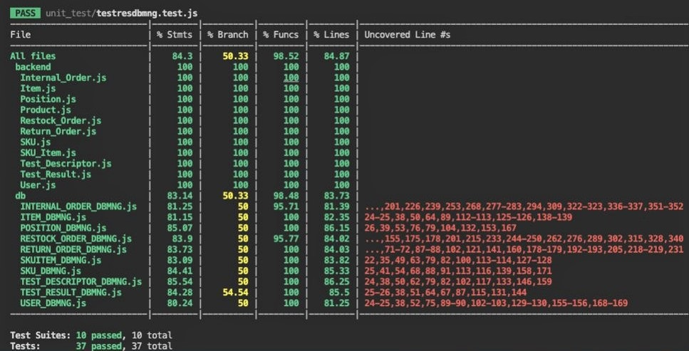

# Unit Testing Report

Date: 21/06/2022

Version: 1.4

| Version number | Change                       |
|----------------|------------------------------|
| 1.0            | Added white box unit tests   |
| 1.1            | Added code coverage report   |
| 1.2            | Added black box unit tests   |
| 1.3            | Added black box unit test for Item  |
| 1.4            | Modification of black box tests |

# Contents

- [Black Box Unit Tests](#black-box-unit-tests)

- [White Box Unit Tests](#white-box-unit-tests)

# Black Box Unit Tests

### **Class  SKU_DBMNG - method createSKU **

**Criteria for method createSKU:**

- Type of description
- Type of weight
- Type of volume
- Type of notes
- Type of position
- Type of price
- Type of quantity
- Length of weight
- Length of volume 
- Length of price 
- Length of quantity 
  
**Predicates for method createSKU:**

| Criteria            | Predicate |
|---------------------|-----------|
| Type of description | String    |
| Type of weight      | Float     |
| Type of volume      | Float     |
| Type of notes       | String    |
| Type of position    | String    |
| Type of price       | Float     |
| Type of quantity    | Integer   |
| Length of weight    | > 0       |
| Length of volume    | > 0       |
| Length of price     | > 0       |
| Length of quantity  | > 0       |

**Boundaries**:

| Criteria                   | Boundary values |
|----------------------------|-----------------|
| Length of weight           |   0             |
| Length of volume           |   0             |
| Length of price            |   0             |
| Length of quantity         |   0             |

**Combination of predicates**:

| Length of weight | Length of volume | Length of price | Length of quantity | Valid / Invalid | Description of the test case                                                    | Jest test case              |
|------------------|------------------|-----------------|--------------------|-----------------|---------------------------------------------------------------------------------|-----------------------------|
| > 0              | > 0              | > 0             | > 0                | Valid           | T1("desc",50,30,"note","800554",15.99,20) -> SKU created                        | skudbmng.test.js/testNewSKU |
| 0                | 0                | 0               | 0                  | Invalid         | T2("description","","","note2","900584","","") -> error, SKU can not be created | skudbmng.test.js/testNewSKU |
| > 0              | > 0              | 0               | 0                  | Invalid         | T3("a sku",100,50,"note3,"10548245","","") -> error, SKU can not be created     | skudbmng.test.js/testNewSKU |
| 0                | 0                | 0               | 0                  | Invalid         | T4("","","","","","","") -> error, SKU can not be created                       | skudbmng.test.js/testNewSKU |
| > 0              | > 0              | > 0             | > 0                | Valid           | T5("",30,20,"","85415",25.50,50) -> SKU created                                 | skudbmng.test.js/testNewSKU |

### **Class  SKUITEM_DBMNG - method createSKUItem **

**Criteria for method createSKUItem:**

- Type of rfid
- Type of available
- Type of date of stock
- Type of skuid
- Length of skuid
- Length of rfid

**Predicates for method createSKUItem:**

| Criteria              | Predicate |
|-----------------------|-----------|
| Type of rfid          | String    |
| Type of available     | Boolean   |
| Type of date of stock | String    |
| Type of skuid         | Integer   |
| Length of skuid       | > 0       |
| Length of rfid        | > 0       |

**Boundaries**:

| Criteria                   | Boundary values |
|----------------------------|-----------------|
| Length of skuid            |   0  maxint  |
| Length of rfid             |   0  maxint  |

**Combination of predicates**:

| Length of skuid | Length of rfid | Valid / Invalid | Description of the test case                                     | Jest test case                      |
|-----------------|----------------|-----------------|------------------------------------------------------------------|-------------------------------------|
| > 0             | > 0            | Valid           | T1("12345678",true,"2022/05/10",5) -> SKUItem created            | skuitemdbmng.test.js/testNewSKUItem |
| > 0             | 0              | Invalid         | T2("",true,"2022/10/10",maxint) -> error, SKUItem can not be created  | skuitemdbmng.test.js/testNewSKUItem |
| 0               | 0              | Invalid         | T3("",true,"2022/11/05","") -> error, SKUItem can not be created | skuitemdbmng.test.js/testNewSKUItem |

### **Class  ITEM_DBMNG - method createItem **

**Criteria for method createItem:**

- Type of id
- Type of description
- Type of price
- Type of skuid
- Type of supplier id
- Length of id
- Length of price
- Length of skuid
- Length of supplier id

**Predicates for method createItem:**

| Criteria              | Predicate |
|-----------------------|-----------|
| Type of id            | Integer   |
| Type of description   | String    |
| Type of price         | Float     |
| Type of skuid         | Integer   |
| Type of supplier id   | Integer   |
| Length of id          | > 0       |
| Length of price       | > 0       |
| Length of skuid       | > 0       |
| Length of supplier id | > 0       |

**Boundaries**:

| Criteria                   | Boundary values |
|----------------------------|-----------------|
| Length of id               |   0             |
| Length of skuid            |   0             |
| Length of supplier id      |   0             |
| Length of price       | 0       |

**Combination of predicates**:

| Length of id | Length of price | Length of skuid | Length of supplier id | Valid / Invalid | Description of the test case                                      | Jest test case                |
|--------------|-----------------|-----------------|-----------------------|-----------------|-------------------------------------------------------------------|-------------------------------|
| > 0          | >0              | > 0             | > 0                   | Valid           | T1(5,"desc",15.99,50,20) -> Item created                          | itemdbmng.test.js/testNewItem |
| 0            | 0               | 0               | 0                     | Invalid         | T2("","","","","") -> error, Item can not be created              | itemdbmng.test.js/testNewItem |
| > 0          | 0               | > 0             | 0                     | Invalid         | T3(22,"description",12.50,5,"") -> error, Item can not be created | itemdbmng.test.js/testNewItem |

### **Class  USER_DBMNG - method createUser **

**Criteria for method createUser:**
	
- Type of email
- Type of password
- Type of name
- Type of surname
- Type of type 
- Format of email
- Length of email
- Length of password
- Length of name
- Length of surname
- Length of type      

**Predicates for method createUser:**

| Criteria           | Predicate |
|--------------------|-----------|
| Type of email      | String    |
| Type of password   | String    |
| Type of name       | String    |
| Type of surname    | String    |
| Type of type       | String    |
| Format of email    | email@email.com  " "|
| Length of email    | > 0  |
| Length of password | > 0  |
| Length of name     | > 0  |
| Length of surname  | > 0  |
| Length of type     | > 0  |

**Boundaries**:

| Criteria                   | Boundary values |
|----------------------------|-----------------|
| Length of email            |   0             |
| Length of password         |   0             |
| Length of name             |   0             |
| Length of surname          |   0             |
| Length of type             |   0             |

**Combination of predicates**:

| Length of id | Length of price | Length of skuid | Length of supplier id | Valid / Invalid | Description of the test case                                      | Jest test case                |
|--------------|-----------------|-----------------|-----------------------|-----------------|-------------------------------------------------------------------|-------------------------------|
| > 0          | >0              | > 0             | > 0                   | Valid           | T1(5,"desc",15.99,50,20) -> Item created                          | itemdbmng.test.js/testNewItem |
| 0            | 0               | 0               | 0                     | Invalid         | T2("","","","","") -> error, Item can not be created              | itemdbmng.test.js/testNewItem |
| > 0          | 0               | > 0             | 0                     | Invalid         | T3(22,"description",12.50,5,"") -> error, Item can not be created | itemdbmng.test.js/testNewItem |

### **Class  TEST_DESCRIPTOR_DBMNG - method createTestDescriptor **

**Criteria for method createTestDescriptor:**

- Type of skuid
- Type of procedure description
- Type of name
- Length of skuid
- Length of procedure description
- Length of name

**Predicates for method createTestDescriptor:**

| Criteria                   | Predicate      |
|----------------------------|----------------|
| Type of  skuid        | Integer |
| Type of  procedure description        | String |
| Type of  name        | String |
| Length of skuid       | > 0 |
| Length of procedure description       | > 0 |
| Length of name       | > 0 |

**Boundaries**:

| Criteria                   | Boundary values |
|----------------------------|-----------------|
| Length of skuid    |   0             |
| Length of procedure description    |   0             |
| Length of name    |   0             |

**Combination of predicates**:

| Length of skuid | Length of procedure description | Length of name | Valid / Invalid | Description of the test case                                            | Jest test case                        |
|-----------------|---------------------------------|----------------|-----------------|-------------------------------------------------------------------------|---------------------------------------|
| > 0             | > 0                             | > 0            | Valid           | T1("td","desc",20) -> Test Descriptor is created                        | testdescdbmng.test.js/testNewTestDesc |
| 0               | 0                               | 0              | Invalid         | T2("","","") -> error, Test Descriptor can not be created               | testdescdbmng.test.js/testNewTestDesc  |
|  0              | > 0                             | > 0            | Invalid         | T3("td3","description","") -> error, Test Descriptor can not be created |testdescdbmng.test.js/testNewTestDesc |
| 0               | 0                               | > 0            | Invalid         | T4("td5","","") -> error, Test Descriptor can not be created            |testdescdbmng.test.js/testNewTestDesc |

### **Class  TEST_RESULT_DBMNG - method createTestResult **

**Criteria for method createTestResult:**

- Type of rfid
- Type of test descriptor id
- Type of date
- Type of result
- Length of test descriptor id
- Length of rfid
- Length of result
- Length of date

**Predicates for method createTestResult:**

| Criteria                   | Predicate      |
|----------------------------|----------------|
| Type of test descriptor id        | Integer |
| Type of rfid        | String |
| Type of date       | Date |
| Type of result        | Boolean |
| Length of test descriptor id        | > 0 |
| Length of rfid       | > 0 |
| Length of result     | > 0 |
| Length of date     | > 0 |

**Boundaries**:

| Criteria                   | Boundary values |
|----------------------------|-----------------|
| Length of test descriptor id      |   0             |
| Length of rfid         |   0             |
| Length of result         |   0             |
| Length of date         |   0             |

**Combination of predicates**:

| Length of test descriptor id | Length of rfid | Length of date | Length of result | Valid / Invalid | Description of the test case                                         | Jest test case                      |
|------------------------------|----------------|----------------|------------------|-----------------|----------------------------------------------------------------------|-------------------------------------|
| >0                           | > 0            | > 0            | > 0              | Valid           | T1("12345678910",10,"10/06/2022",true) -> Test Result is created     | testresdbmng.test.js/testNewTestRes |
| 0                            | 0              | 0              | 0                | Invalid         | T2("","","","") -> error, Test Result can not be created             | testresdbmng.test.js/testNewTestRes|
| 0                            |  0             | > 0            | > 0              | Invalid         | T3("","","02/10/2022",true) -> error, Test Result can not be created |testresdbmng.test.js/testNewTestRes |
| 0                            | 0              | 0              | > 0              | Invalid         | T4("","","",true) -> error, Test Result can not be created           | testresdbmng.test.js/testNewTestRes|

### **Class  POSITION_DBMNG - method createPosition **

**Criteria for method createPosition:**

- Type of position id
- Type of aisle id
- Type of row
- Type of column
- Type of max weigt
- Type of max volume
- Type of occupied weight
- Type of occupied volume
- Length of aisle id
- Length of position id
- Length of row
- Length of col
- Length of max weight
- Length of max volume
- Length of occupied weight
- Length of occupied volume

**Predicates for method createPosition:**

| Criteria                   | Predicate      |
|----------------------------|----------------|
| Length of position id        | > 0 |
| Length of aisle id        | > 0 |
| Length of row             | > 0 |
| Length of col             | > 0 |
| Length of max weight             | > 0 |
| Length of max volume             | > 0 |
| Length of occupied weight             | > 0 |
| Length of occupied volume             | > 0 |

**Boundaries**:

| Criteria                   | Boundary values |
|----------------------------|-----------------|
| Length of position id      |   0             |
| Length of aisle id         |   0             |
| Length of row              |   0             |
| Length of col              |   0             |
| Length of max weight             |  0 |
| Length of max volume             |  0 |
| Length of occupied weight             |  0 |
| Length of occupied volume             |  0 |

**Combination of predicates**:

| Length of position id | Length of aisle id | Length of row | Length of col | Length of max weight | Length of max volume | Length of occupied weight | Length of occupied volume | Valid / Invalid | Description of the test case                                                     | Jest test case                        |
|-----------------------|--------------------|---------------|---------------|----------------------|----------------------|---------------------------|---------------------------|-----------------|----------------------------------------------------------------------------------|---------------------------------------|
| > 0                   | > 0                | > 0           | > 0           | >0                   | > 0                  | > 0                       | > 0                       | Valid           | T1("80024561238","50","5","12",200,200,30,20) -> Test Result is created          | positiondbmng.test.js/testNewPosition |
| 0                     | 0                  | 0             | 0             | 0                    | 0                    | 0                         | 0                         | Invalid         | T2("","","","","","","","") -> error, Position can not be created                |positiondbmng.test.js/testNewPosition|
| > 0                   | 0                  | 0             | 0             | 0                    |  0                   | > 0                       | > 0                       | Invalid         | T3("78451235464","","","","","",50,50) -> error, Position can not be created     |positiondbmng.test.js/testNewPosition |
| 0                     | > 0                | >0            | 0             | 0                    | 0                    | >0                        |  0                        | Invalid         | T4("","40","20","","","",80,"") -> error, Position can not be created            |positiondbmng.test.js/testNewPosition|
| >0                    | >0                 | 0             | 0             | >0                   | >0                   | >0                        | >0                        | Invalid         | T5("82014464578","10","","",300,400,10,10) -> error, Position can not be created |positiondbmng.test.js/testNewPosition |

### **Class  RETURN_ORDER_DBMNG - method createReturnOrder **

**Criteria for method createReturnOrder:**

 - Type of return date
 - Type of return order id
 - Length of restock order id
 - Length of return date
 - Length of products

**Predicates for method createReturnOrder:**

| Criteria                   | Predicate      |
|----------------------------|----------------|
| Type of return date        | Date String |
| Type of restock order id   | Integer        |
| Length of restock order id | > 0            |
| Length of return date      | > 0            |
| Length of products         | > 0            |

**Boundaries**:

| Criteria                   | Boundary values |
|----------------------------|-----------------|
| Length of restock order id | maxint   0   |
| Length of return date |  0   |
| Length of products |  0   |

**Combination of predicates**:

| Length of restock order id | Length of return date | Length of products | Valid / Invalid | Description of the test case                                                                                                               | Jest test case                              |
|----------------------------|-----------------------|--------------------|-----------------|--------------------------------------------------------------------------------------------------------------------------------------------|---------------------------------------------|
| > 0                        | > 0                   | > 0                | Valid           | T1("2022/02/10 15:30",5,{"SKUId":5, "description":"product", "price":5, "RFID":"12345678901234567890123456789016") -> Return Order created | returnorderdbmng.test.js/testNewReturnOrder |
| 0                          | 0                     | 0                  | Invalid         | T2("","","") -> error, Return Order can not be created                                                                                     | returnorderdbmng.test.js/testNewReturnOrder |
| 0                          | > 0                   | 0                  | Invalid         | T3("2022.06.05","","") -> error, Return Order can not be created                                                                           | returnorderdbmng.test.js/testNewReturnOrder |
| > 0                        | 0                     | 0                  | Invalid         | T4("",maxint,"") -> error, Return Order can not be created                                                                                 | returnorderdbmng.test.js/testNewReturnOrder |

### **Class  RESTOCK_ORDER_DBMNG - method createRestockOrder **

**Criteria for method createRestockOrder:**

 - Type of supplier id
 - Type of state
 - Type of issue date
 - Length of supplier id
 - Length of state
 - Length of issue date
 - Length of products
 - Length of skuItems

**Predicates for method createRestockOrder:**

| Criteria                  | Predicate           |
|---------------------------|---------------------|
| Type of supplier id       | Integer             |
| Type of state             | String undefined |
| Type of issue date        | Date   String    |
| Length of supplier id     | > 0                 |
| Length of state           | > 0                 |
| Length of issue date      | > 0                 |
| Length of products        | > 0                 |
| Length of skuItems        | > 0                 |

**Boundaries**:

| Criteria                   | Boundary values |
|----------------------------|-----------------|
| Length of supplier id      | maxint    0  |
| Length of state            | 0               |
| Length of issue date       | 0               |
| Length of products         | 0               |
| Length of skuItems         | 0               |

**Combination of predicates**:

| Length of supplier id | Length of state | Length of issue date | Length of products | Length of skuItems | Valid / Invalid | Description of the test case                                                                                                                                                                                               | Jest test case                                |
|-----------------------|-----------------|----------------------|--------------------|--------------------|-----------------|----------------------------------------------------------------------------------------------------------------------------------------------------------------------------------------------------------------------------|-----------------------------------------------|
| > 0                   | > 0             | > 0                  |  > 0               | > 0                | Valid           | T1(5,"state","2022/05/20 10:30",{"deliveryDate":"2022/05/20"},{ "SKUId": 12, "description": "a product", "price": 10.99, "qty": 30 },{ "SKUId": 12, "RFID": "12345678901234567890123456789016" }) -> Restock Order created | restockorderdbmng.test.js/testNewRestockOrder |
| 0                     | 0               | 0                    | 0                  | 0                  | Invalid         | T2("","","","","","") -> error, Restock Order can not be created                                                                                                                                                           | restockorderdbmng.test.js/testNewRestockOrder |
| > 0                   | 0               | > 0                  | 0                  | 0                  | Invalid         | T3(maxint,"","20221010","","","") -> error, Restock Order can not be created                                                                                                                                               | restockorderdbmng.test.js/testNewRestockOrder |
| > 0                   | 0               | > 0                  | 0                  | 0                  | Invalid         | T4(2,"","2022/10/10 09:45","","","") -> error, Restock Order can not be created                                                                                                                                            | restockorderdbmng.test.js/testNewRestockOrder |

### **Class  INTERNAL_ORDER_DBMNG - method createInternalOrder **

**Criteria for method createInternalOrder:**

 - Type of customer id
 - Type of state
 - Type of issue date
 - Length of supplier id
 - Length of state
 - Length of issue date
 - Length of products

**Predicates for method createInternalOrder:**

| Criteria                  | Predicate           |
|---------------------------|---------------------|
| Type of customer id       | Integer             |
| Type of state             | String undefined |
| Type of issue date        | Date   String    |
| Length of customer id     | > 0                 |
| Length of state           | > 0                 |
| Length of issue date      | > 0                 |
| Length of products        | > 0                 |

**Boundaries**:

| Criteria                   | Boundary values |
|----------------------------|-----------------|
| Length of customer id      | maxint   0   |
| Length of state            | 0               |
| Length of issue date       | 0               |
| Length of products         | 0               |

**Combination of predicates**:

| Length of customer id | Length of state | Length of issue date | Length of products | Valid / Invalid | Description of the test case                                                  | Jest test case                                  |
|-----------------------|-----------------|----------------------|--------------------|-----------------|-------------------------------------------------------------------------------|-------------------------------------------------|
| > 0                   | > 0             | > 0                  | > 0                | Valid           | T1(1,"issued","2022/04/05 11:20",{ "SKUId": 12, "description": "a product", "price": 10.99, "qty": 3 }) -> Internal Order created                   | internalorderdbmng.test.js/testNewInternalOrder |
| > 0                   | > 0             | > 0                  | 0                  | Invalid         | T2(100,"issued","20220202","") -> error, Internal Order can not be created    | internalorderdbmng.test.js/testNewInternalOrder |
| > 0                   | 0               | > 0                  | 0                  | Invalid         | T3(5000,"","2022/10/10 15:30","") -> error, Internal Order can not be created | internalorderdbmng.test.js/testNewInternalOrder |
| 0                     | 0               | 0                    | 0                  | Invalid         | T4("","","","") -> error, Internal Order can not be created                   | internalorderdbmng.test.js/testNewInternalOrder |
| >0                    | 0               | 0                    | 0                  | Invalid         | T5(maxint,"","","") -> error, Internal Order can not be created                    | internalorderdbmng.test.js/testNewInternalOrder |

# White Box Unit Tests

### Test cases definition
    

| Unit name | Jest test case |
|-----------|----------------|
| SKU_DBMNG |delete table create new sku modify sku|
| SKUITEM_DBMNG |delete table create new sku item modify and delete sku item |
| ITEM_DBMNG | delete table create new item modify and delete item|
| USER_DBMNG | delete table  create a new user   test supplier user   modify and delete user|
| TEST_DESCRIPTOR_DBMNG |delete table create new test descriptor   get a test descriptor by skuid  modify and delete test descriptor   delete test desctiptor by skuid |
|TEST_RESULT_DBMNG | delete table  create new test result   modify and delete test result |
| POSITION_DBMNG | delete table  create new position   modify and delete position   modify position id|
|INTERNAL_ORDER_DBMNG| delete table create and get a new internal order   get and delete accepted internal order   create, modify and delete internal order |
| RETURN_ORDER_DBMNG | delete table  create a new return order   delete a return order |
| RESTOCK_ORDER_DBMNG| delete table  create a new restock order   get an issued order   modify and delete restock order|

### Code coverage report

 

### Loop coverage analysis

Not applicable due to lack of important loops in the code.

